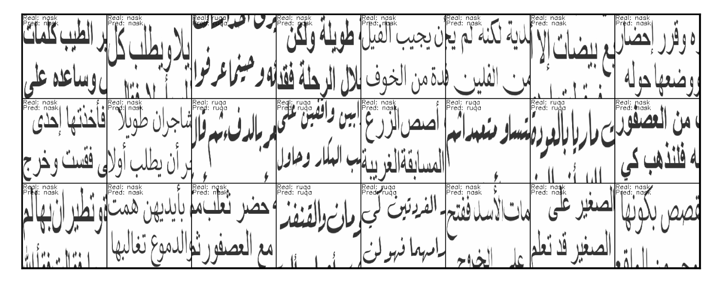
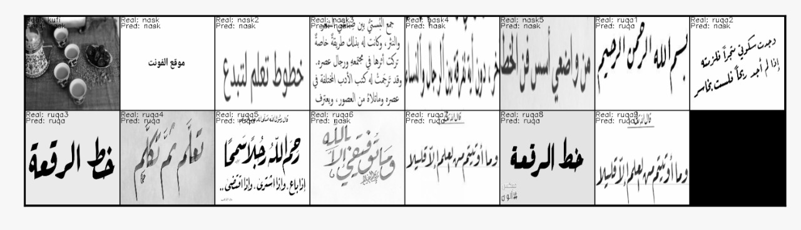

# Arabic-Font-Detector
This model detects arabic fonts (نسخ, رقعة، كوفي) given a picture of the text
 
Built using Pytorch and kids stories. 

### Data
We used various computer fonts of Nask (نسخ) and Ruqa (رقعة)) and took pictures of those then spliced them up and fed them to a convolutional neural network. The models are under the <code>Results</code> folder. The data is too large for github so open an issue and we'll supply them. 

### Results

##### Train
Here is a sample of the training data:

##### Validation
Here is a sample of the validation data:

##### Outside samples
